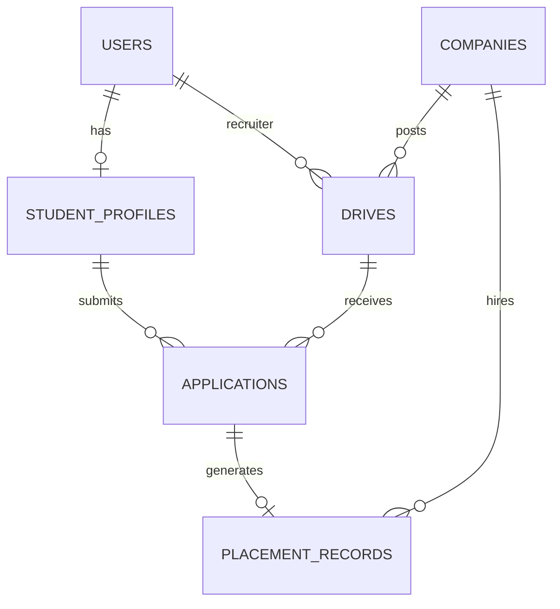

# 🎓 CampusConnect: Campus Placement & Internship Management System

A role-based, full-stack MERN placement platform designed for **Students**, **Corporate Recruiters**, and **Placement Officers (TPO)** with real-time eligibility evaluation, recruitment status pipeline tracking, institutional policy enforcement, and live analytics.

---

## 🌟 Key Highlights & Features

### 1. 🛡️ 3-Tier Role-Based Security & Dashboards
- **Student Portal**: Academic profile manager (CGPA, Branch, Backlogs, Skills, Resume link), Drive Explorer with live eligibility feedback badges, 1-Click Application, 5-stage recruitment status timeline tracker, and Placement offer letter repository.
- **Recruiter Portal**: Authorized company drive manager, candidate review table with resume previews, and recruitment status modifier (`Applied` ➔ `Shortlisted` ➔ `Interviewed` ➔ `Selected` / `Rejected`) with audit remarks.
- **Placement Officer (TPO Admin) Portal**: Live interactive Recharts placement dashboard, institution student directory, drive creator, single-offer policy engine settings, and CSV report export.

---

### 2. ⚡ Automated Eligibility Validation Engine
Every drive's eligibility is evaluated **server-side** and verified before allowing an application:
- **CGPA Cutoff**: `Student.CGPA >= Drive.minCGPA`
- **Branch Restriction**: `Drive.eligibleBranches.includes(Student.branch)`
- **Backlog Cap**: `Student.activeBacklogs <= Drive.maxBacklogs`
- **Graduation Batch**: `Drive.eligibleYears.includes(Student.graduationYear)`
- **Drive Status & Deadlines**: Only Active drives accepting applications before expiry are permitted.

---

### 3. 🔒 Institutional Placement Policy Guard
- **Single-Offer Restriction (1-Offer Rule)**: Once a student is marked **Selected** for a placement drive, subsequent applications are blocked to ensure fair offer distribution across students.
- **Dream Offer Upgrades**: Configurable option to allow placed students to apply if the new offer exceeds a multiplier threshold (e.g. $\ge 1.5\times$ current CTC).

---

### 4. 📊 Live Visual Analytics & Reporting
- **Placement Rate**: Placed vs. Unplaced ratios with live percentage.
- **Branch-Wise Analytics**: Stacked bar charts for CSE, IT, AI/ML, ECE, EE, ME.
- **Recruitment Funnel**: Visual stage progression (`Applied` ➔ `Shortlisted` ➔ `Interviewed` ➔ `Selected`).
- **One-Click CSV Export**: Complete placement report generation for NAAC/NBA accreditations.

---

## 🗄️ Database Architecture



---

## 🚀 Quick Start & Installation

### Prerequisites
- **Node.js** (v18+)
- **npm** (v9+)

### 1. Install All Dependencies
```bash
# From the project root
npm run install:all
```

### 2. Start the Backend API Server
```bash
npm run server:dev
```
> **Note:** The backend has a **zero-config embedded memory database** with automatic pre-seeding. It starts instantly without needing a local MongoDB daemon installed! You can also connect to MongoDB Atlas by setting `MONGODB_URI` in `.env`.

### 3. Start the Frontend React Client
```bash
npm run client
```
The React application will be available at: **http://localhost:3000**

---

## 🧪 Automated Test Suite

To verify all 12 project requirements:
```bash
npm test
```

### 12-Point Verification Checklist:
- [x] Student can register and log in (Bcrypt + JWT)
- [x] Recruiter cannot access admin-only APIs
- [x] Student can create and update their academic profile
- [x] Ineligible student cannot apply (server-side rejection)
- [x] Eligible student can apply successfully
- [x] Duplicate applications to the same drive are blocked
- [x] Expired or inactive drives reject new applications
- [x] Unauthorized recruiter cannot modify another company's drive
- [x] Application status follows allowed transitions with audit logs
- [x] Selected student is blocked from new applications by placement policy
- [x] Dashboard analytics match database counts
- [x] Invalid inputs and schema violations are handled gracefully

---

## 🔑 Pre-Seeded Demo Accounts (1-Click Login)

For viva demonstrations, you can click the quick-login buttons on the top banner or use these credentials:

| Role | Name / Organization | Email | Password |
| :--- | :--- | :--- | :--- |
| **Admin (TPO)** | Prof. Rajesh Sharma (Head TPO) | `admin@campusconnect.edu` | `admin123` |
| **Recruiter** | Sarah Jenkins (Google India) | `recruiter.google@campusconnect.edu` | `recruiter123` |
| **Recruiter** | David Chen (Microsoft) | `recruiter.microsoft@campusconnect.edu` | `recruiter123` |
| **Student (Eligible)** | Aarav Sharma (CSE, 8.85 CGPA, 0 Backlogs) | `aarav.cse@campusconnect.edu` | `student123` |
| **Student (Backlogs)** | Rohan Verma (ECE, 6.4 CGPA, 1 Backlog) | `rohan.ece@campusconnect.edu` | `student123` |
| **Student (Placed)** | Priya Nair (AI/ML, 9.3 CGPA, Placed at MSFT) | `priya.aiml@campusconnect.edu` | `student123` |

---

## 📁 Project Directory Structure

```
CampusConnect/
├── client/                     # React + Vite + Tailwind CSS Frontend
│   ├── src/
│   │   ├── components/         # Navbar, Sidebar, EligibilityBadge, StatusTimeline, DemoBanner
│   │   ├── context/            # AuthContext & State Management
│   │   ├── pages/
│   │   │   ├── student/        # Dashboard, Profile, Drive Explorer, My Applications
│   │   │   ├── recruiter/      # Recruiter Dashboard, Candidate Pipeline
│   │   │   └── admin/          # Analytics, Drives, Student Database, Policy, CSV Reports
│   │   ├── services/           # Axios API Client
│   │   ├── App.jsx             # React Router v6 & Protected Routes
│   │   └── main.jsx
│   ├── package.json
│   └── vite.config.js
│
├── server/                     # Node.js + Express + MongoDB Backend
│   ├── src/
│   │   ├── config/             # DB Connection & Memory Server Fallback
│   │   ├── controllers/        # Auth, Student, Drive, Application, Admin, Company
│   │   ├── middleware/         # JWT Auth Guard, Role Authorization, Error Handler
│   │   ├── models/             # User, StudentProfile, Company, Drive, Application, PlacementRecord, Setting
│   │   ├── routes/             # REST Endpoints
│   │   ├── services/           # Eligibility Engine, Placement Policy, Seed Generator
│   │   ├── app.js              # Express App & Route Assembly
│   │   └── server.js           # Server Entrypoint
│   ├── tests/                  # Automated Test Suite (14-Point Checklist)
│   └── package.json
├── api/                        # Vercel Serverless Function Entrypoint
├── vercel.json                 # Vercel Deployment Configuration
├── DEPLOYMENT.md               # Detailed Vercel Deployment Guide
└── package.json
```

---

## 🚀 One-Click Vercel Deployment

This project is configured for deployment on **Vercel** out of the box:

1. Push this repository to GitHub.
2. Import the repository in [Vercel](https://vercel.com).
3. Set your environment variables:
   - `MONGODB_URI`: Your MongoDB Atlas connection string (`mongodb+srv://...`)
   - `JWT_SECRET`: A secure random secret string
   - `NODE_ENV`: `production`
4. Click **Deploy**.

For in-depth instructions and CLI deployment, see [DEPLOYMENT.md](file:///Users/mollyarora/assignemnt/DEPLOYMENT.md).

